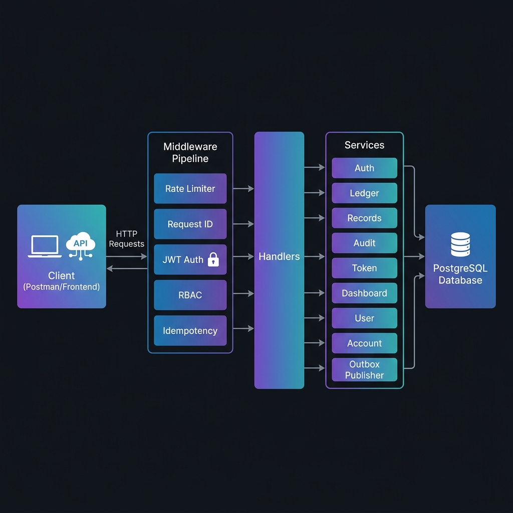
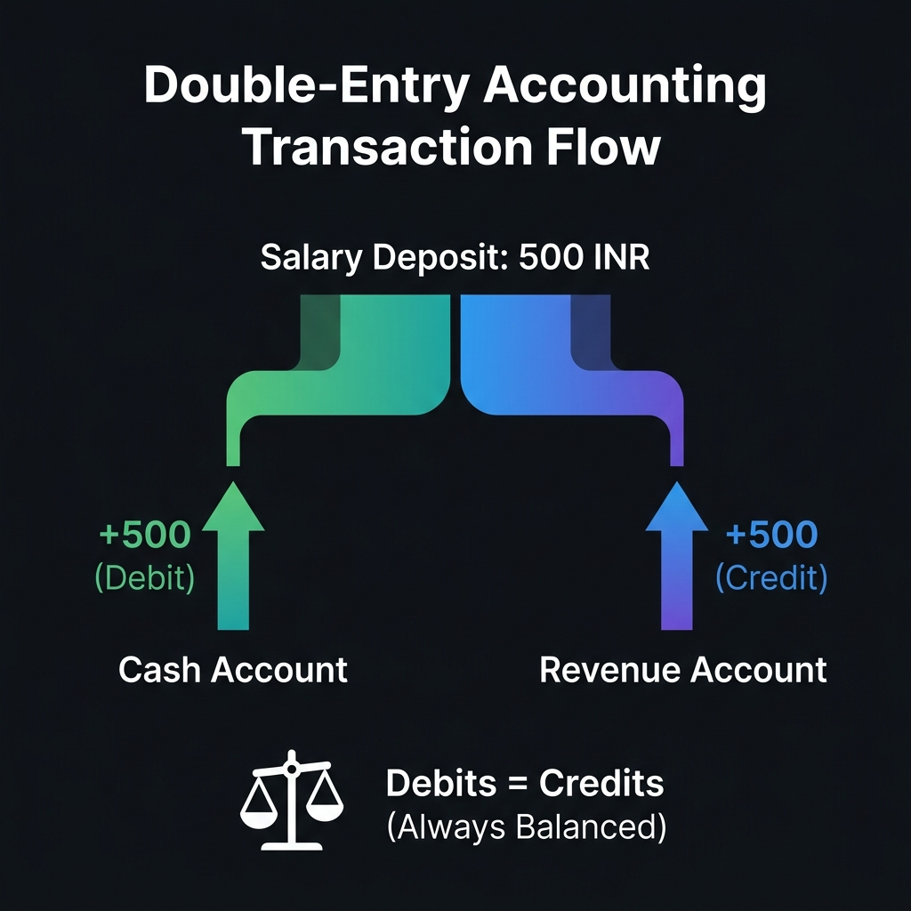
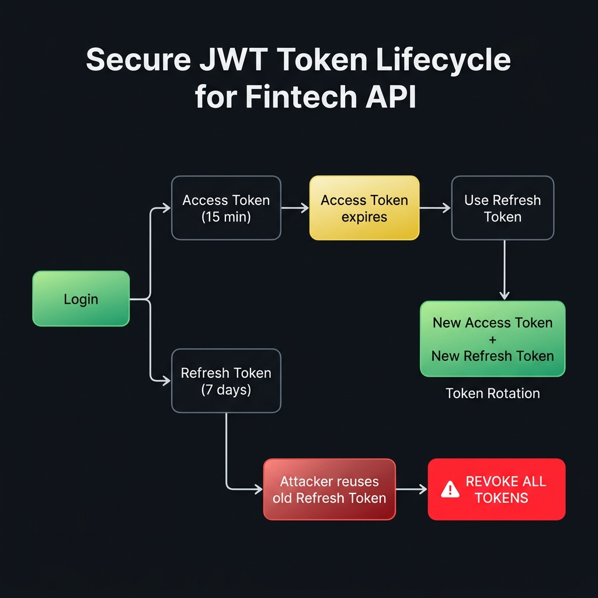

<p align="center">
  <h1 align="center">🛡️ ImmutableCore</h1>
  <p align="center">
    <strong>A production-grade financial services API built with Go</strong>
  </p>
  <p align="center">
    Double-entry ledger &bull; Token rotation &bull; Idempotent transactions &bull; SOC 2-ready audit trail
  </p>
  <p align="center">
    
    
    
    
    
    
  </p>
</p>

---

## Project Overview

**ImmutableCore** is a robust financial backend designed to handle double-entry accounting with strict consistency and security guarantees. It demonstrates the implementation of critical financial system patterns, focusing on data integrity, traceability, and secure access control.

Key architectural patterns implemented:

- **Double-entry bookkeeping** ensures every rupee is accounted for (debits always equal credits)
- **Idempotent mutations** prevent duplicate charges when clients retry failed requests
- **Token rotation with replay attack detection** automatically revokes all sessions if a stolen refresh token is reused
- **Transactional audit logging** creates an immutable, SOC 2-compliant trail of every state change

---

## Architecture

<p align="center">
  
</p>

Every HTTP request passes through a layered middleware pipeline before reaching business logic. The architecture enforces a strict one-directional dependency graph with zero circular imports:

```
Client Request
    |
    v
[ Rate Limiter ] --> [ Request ID ] --> [ JWT Auth ] --> [ RBAC ] --> [ Idempotency ]
                                                                          |
                                                                          v
                                                                    [ Handlers ]
                                                                          |
                                                                          v
                                                                    [ Services ]
                                                                     /    |    \
                                                                    v     v     v
                                                              [ Models ] [ Utils ] [ Errors ]
                                                                    \     |     /
                                                                     v    v    v
                                                                  [ PostgreSQL ]
```

**Key Design Principles:**
- Handlers only parse HTTP; all business logic lives in services
- Database queries never appear in handler code
- Every mutating operation runs inside a database transaction
- Audit events are written atomically with business data (transactional outbox pattern)

---

## Core Features

### 1. Double-Entry Ledger System

<p align="center">
  
</p>

Every financial transaction in this system follows the **double-entry accounting** standard used by real banks. When money moves, two entries are always created:

```json
{
  "description": "Salary Deposit",
  "entries": [
    { "account_id": "cash-uuid",    "amount": "50000", "entry_type": "debit"  },
    { "account_id": "revenue-uuid", "amount": "50000", "entry_type": "credit" }
  ]
}
```

The system **rejects** any transaction where debits != credits. This makes it mathematically impossible for money to appear or disappear due to a bug. Account balances are updated using `SELECT FOR UPDATE` row-level locking to prevent race conditions under concurrent access.

When a user registers, three default accounts are automatically created inside the same database transaction: **Cash** (asset), **Revenue** (revenue), and **Expenses** (expense).

---

### 2. Idempotent Transactions (No Double-Charging)

Every mutating endpoint (`POST`, `PUT`, `DELETE`) supports idempotency via the `Idempotency-Key` header:

```
POST /api/ledger/transactions
Idempotency-Key: 550e8400-e29b-41d4-a716-446655440000
```

| Scenario | What Happens |
|----------|-------------|
| First request with key X | Processed normally, response cached for 24 hours |
| Retry with same key X + same body | Cached response returned instantly (no duplicate operation) |
| Same key X + different body | `422 Unprocessable Entity` (mismatch detected) |
| No key provided | Request processed normally every time (opt-in idempotency) |

This prevents the classic "user clicked Pay twice" problem that plagues naive payment systems.

---

### 3. Secure Token Lifecycle

<p align="center">
  
</p>

Login issues a **short-lived access token** (15 min) paired with a **long-lived refresh token** (7 days). The system implements automatic **token rotation** with replay attack detection:

| Event | System Response |
|-------|----------------|
| Login | Issues `access_token` (15 min) + `refresh_token` (7 days) |
| Access token expires | Client sends refresh token to `/auth/refresh` |
| Valid refresh | Old refresh token revoked, new pair issued (rotation) |
| Attacker reuses old refresh token | **All tokens in the family are revoked immediately** |
| Logout | All refresh tokens for the user are destroyed |

Refresh tokens are stored as **SHA-256 hashes** in the database. The raw token is never persisted. Each token belongs to a "family" (identified by a UUID), enabling family-wide revocation when replay attacks are detected.

---

### 4. SOC 2-Ready Audit Trail

Every state-changing operation (create, update, delete, login) automatically records an immutable audit event **inside the same database transaction** as the business operation. This guarantees the audit trail is always consistent with the actual data, even if the server crashes mid-request.

```json
{
  "id": "audit-uuid",
  "entity_type": "user",
  "entity_id": "user-uuid",
  "action": "create",
  "actor_id": "admin-uuid",
  "changes": "{\"role\": \"analyst\"}",
  "request_id": "req-uuid",
  "ip_address": "192.168.1.1",
  "created_at": "2026-06-03T12:00:00Z"
}
```

Each audit event also creates an **outbox entry** for downstream event streaming (webhooks, message queues). A background goroutine processes the outbox every 5 seconds, simulating reliable event delivery.

---

### 5. Role-Based Access Control (RBAC)

Three distinct permission tiers enforced at the middleware layer:

| Capability | Viewer | Analyst | Admin |
|:-----------|:------:|:-------:|:-----:|
| Register / Login | ✅ | ✅ | ✅ |
| View financial records | ✅ | ✅ | ✅ |
| View dashboard summary | ✅ | ✅ | ✅ |
| View trends & category analytics | ❌ | ✅ | ✅ |
| Create / Update / Delete records | ❌ | ❌ | ✅ |
| Post ledger transactions | ❌ | ❌ | ✅ |
| Manage users | ❌ | ❌ | ✅ |
| View audit log | ❌ | ❌ | ✅ |

**Security enforcement:** Admin role cannot be self-assigned during registration. Users must register as `viewer` or `analyst` and be promoted by an existing admin. This prevents privilege escalation attacks.

---

### 6. Typed Error System

All errors are returned as structured `AppError` objects with machine-readable codes, preventing error-message-based string matching in client code:

```go
type AppError struct {
    Code       string // "VALIDATION_ERROR", "NOT_FOUND", "CONFLICT", etc.
    Message    string // Human-readable description
    StatusCode int    // HTTP status code
    Details    error  // Wrapped internal error (never exposed to clients)
}
```

Every API response follows a consistent JSON envelope:

```json
{
  "success": false,
  "message": "email already registered",
  "data": null
}
```

---

### 7. Decimal-Precise Money Handling

All monetary amounts use `shopspring/decimal` instead of floating-point arithmetic. This prevents rounding errors that plague systems using `float64`:

```
float64:  0.1 + 0.2 = 0.30000000000000004  (WRONG for money)
decimal:  0.1 + 0.2 = 0.3                  (CORRECT)
```

---

## API Reference

### Public Endpoints

| Method | Route | Description |
|--------|-------|-------------|
| `GET` | `/health` | Health check / liveness probe |
| `POST` | `/auth/register` | Register a new user |
| `POST` | `/auth/login` | Login, receive access + refresh tokens |
| `POST` | `/auth/refresh` | Rotate tokens using a refresh token |

### Protected Endpoints (Require `Authorization: Bearer <token>`)

| Method | Route | Required Role | Description |
|--------|-------|:------------:|-------------|
| `POST` | `/api/auth/logout` | Any | Revoke all refresh tokens |
| `GET` | `/api/users` | Admin | List all users |
| `PUT` | `/api/users/:id` | Admin | Update user role/status |
| `DELETE` | `/api/users/:id` | Admin | Hard-delete a user |
| `GET` | `/api/records` | Viewer+ | List records (filtered, paginated) |
| `POST` | `/api/records` | Admin | Create a financial record |
| `GET` | `/api/records/:id` | Viewer+ | Get a single record by ID |
| `PUT` | `/api/records/:id` | Admin | Update a record |
| `DELETE` | `/api/records/:id` | Admin | Soft-delete a record |
| `GET` | `/api/dashboard/summary` | Viewer+ | Income/expense/balance summary |
| `GET` | `/api/dashboard/trends` | Analyst+ | Monthly income vs expense trends |
| `GET` | `/api/dashboard/categories` | Analyst+ | Spending breakdown by category |
| `POST` | `/api/ledger/transactions` | Admin | Post a double-entry transaction |
| `GET` | `/api/ledger/transactions` | Viewer+ | List ledger transactions |
| `GET` | `/api/ledger/accounts` | Viewer+ | List all accounts |
| `POST` | `/api/ledger/accounts` | Admin | Create a custom account |
| `GET` | `/api/ledger/accounts/:id/entries` | Viewer+ | Get entries for an account |
| `GET` | `/api/audit` | Admin | Query the audit log |

> **Viewer+** = Viewer, Analyst, Admin &nbsp;|&nbsp; **Analyst+** = Analyst, Admin

---

## Quick Start

### Prerequisites

- **Go** 1.21 or higher
- **PostgreSQL** 12+ (or Docker)
- **Docker** (optional, for running PostgreSQL in a container)

### Option A: Run with Docker (Recommended)

```bash
# Clone the repository
git clone https://github.com/Slambot01/Finance_Project.git
cd Finance_Project

# Start PostgreSQL in Docker
docker run -d --name fintech_postgres \
  -e POSTGRES_USER=postgres \
  -e POSTGRES_PASSWORD=postgres \
  -e POSTGRES_DB=finance_dashboard \
  -p 5432:5432 \
  postgres:16-alpine

# Configure environment
cp .env.example .env

# Install dependencies and run
go mod tidy
go run cmd/main.go
```

### Option B: Use Existing PostgreSQL

```bash
# Clone and configure
git clone https://github.com/Slambot01/Finance_Project.git
cd Finance_Project
cp .env.example .env

# Edit .env with your database credentials
# Then create the database:
psql -U postgres -c "CREATE DATABASE finance_dashboard;"

# Run the application
go mod tidy
go run cmd/main.go
```

**Expected startup output:**
```
Database connection established successfully
Database migration completed successfully
Outbox publisher started (interval: 5s)
Server running on port 8080
```

### Environment Variables

| Variable | Description | Default |
|----------|-------------|---------|
| `DB_HOST` | PostgreSQL host | `localhost` |
| `DB_PORT` | PostgreSQL port | `5432` |
| `DB_USER` | Database username | `postgres` |
| `DB_PASSWORD` | Database password | `postgres` |
| `DB_NAME` | Database name | `finance_dashboard` |
| `JWT_SECRET` | Secret key for signing JWTs | `supersecretkey123` |
| `JWT_EXPIRY_HOURS` | Legacy token expiry (hours) | `24` |
| `ACCESS_TOKEN_EXPIRY_MINUTES` | Access token lifetime | `15` |
| `REFRESH_TOKEN_EXPIRY_DAYS` | Refresh token lifetime | `7` |
| `PORT` | Server port | `8080` |

---

## Usage Examples

### Register a User

```bash
curl -X POST http://localhost:8080/auth/register \
  -H "Content-Type: application/json" \
  -d '{
    "name": "Alice Smith",
    "email": "alice@example.com",
    "password": "securepassword123",
    "role": "analyst"
  }'
```

**Response** `201 Created`
```json
{
  "success": true,
  "message": "user registered successfully",
  "data": {
    "id": "eea46229-7ffc-45e7-a4c1-69fd2dbd57e0",
    "name": "Alice Smith",
    "email": "alice@example.com",
    "role": "analyst",
    "is_active": true,
    "created_at": "2026-06-03T12:13:31Z"
  }
}
```

### Login (Receive Token Pair)

```bash
curl -X POST http://localhost:8080/auth/login \
  -H "Content-Type: application/json" \
  -d '{
    "email": "alice@example.com",
    "password": "securepassword123"
  }'
```

**Response** `200 OK`
```json
{
  "success": true,
  "message": "login successful",
  "data": {
    "access_token": "eyJhbGciOiJIUzI1NiIs...",
    "refresh_token": "a1b2c3d4e5f6...",
    "user": {
      "id": "eea46229-7ffc-45e7-a4c1-69fd2dbd57e0",
      "name": "Alice Smith",
      "email": "alice@example.com",
      "role": "analyst"
    }
  }
}
```

### Post a Ledger Transaction (Admin Only)

```bash
curl -X POST http://localhost:8080/api/ledger/transactions \
  -H "Authorization: Bearer <access_token>" \
  -H "Content-Type: application/json" \
  -H "Idempotency-Key: 550e8400-e29b-41d4-a716-446655440000" \
  -d '{
    "description": "Client Payment Received",
    "entries": [
      { "account_id": "<cash-account-id>",    "amount": "75000", "entry_type": "debit" },
      { "account_id": "<revenue-account-id>", "amount": "75000", "entry_type": "credit" }
    ]
  }'
```

**Response** `201 Created`
```json
{
  "success": true,
  "message": "transaction posted successfully",
  "data": {
    "transaction_id": "dcaf4e52-6471-4856-b4e7-59d8dbaabd67",
    "entries": [...]
  }
}
```

### Query Records with Filters

```bash
curl "http://localhost:8080/api/records?type=expense&category=food&start_date=2026-01-01&end_date=2026-06-01&page=1&page_size=20" \
  -H "Authorization: Bearer <access_token>"
```

### Dashboard Analytics

```bash
curl http://localhost:8080/api/dashboard/summary \
  -H "Authorization: Bearer <access_token>"
```

**Response** `200 OK`
```json
{
  "success": true,
  "message": "dashboard summary retrieved successfully",
  "data": {
    "total_income": 150000.00,
    "total_expenses": 85000.00,
    "net_balance": 65000.00,
    "total_records": 42
  }
}
```

---

## Project Structure

```
FintechAPI_Backend/
│
├── cmd/
│   └── main.go                     # Entry point, DB init, outbox worker startup
│
├── config/
│   └── config.go                   # Env parsing, DB connection pool config
│
├── errors/
│   └── apperrors.go                # Typed error system (AppError with codes)
│
├── models/
│   ├── user.go                     # User model with role enum (viewer/analyst/admin)
│   ├── financial_record.go         # Financial record with soft-delete support
│   ├── account.go                  # Ledger account (asset/liability/revenue/expense)
│   ├── ledger_entry.go             # Double-entry line items (debit/credit)
│   ├── audit_event.go              # Immutable audit trail entries
│   ├── outbox_entry.go             # Transactional outbox for event streaming
│   ├── refresh_token.go            # Refresh token with family-based grouping
│   └── idempotency_key.go          # Idempotency key cache (24h TTL)
│
├── middleware/
│   ├── auth.go                     # JWT extraction and validation
│   ├── rbac.go                     # Role-based access control
│   ├── rate_limiter.go             # IP-based rate limiting (100 req/min)
│   ├── idempotency.go              # Idempotent mutation middleware
│   ├── logger.go                   # Structured request/response logging
│   ├── request_id.go               # UUID correlation ID injection
│   ├── auth_test.go                # 6 tests
│   ├── rbac_test.go                # 5 tests
│   ├── rate_limiter_test.go        # 4 tests
│   └── idempotency_test.go         # 4 tests
│
├── handlers/
│   ├── auth_handler.go             # Register + Login
│   ├── token_handler.go            # Refresh + Logout
│   ├── user_handler.go             # User CRUD (admin only)
│   ├── record_handler.go           # Financial record CRUD
│   ├── dashboard_handler.go        # Analytics endpoints
│   ├── ledger_handler.go           # Double-entry transaction posting
│   ├── audit_handler.go            # Audit log query endpoint
│   └── error_handler.go            # Centralized AppError -> HTTP mapping
│
├── services/
│   ├── auth_service.go             # Registration + login + audit integration
│   ├── token_service.go            # Token pair issuance, rotation, revocation
│   ├── user_service.go             # User management with audit events
│   ├── record_service.go           # Record CRUD with decimal precision
│   ├── dashboard_service.go        # Summary, trends, category analytics
│   ├── ledger_service.go           # Double-entry posting with row-level locking
│   ├── account_service.go          # Account creation + default account setup
│   ├── audit_service.go            # Audit event + outbox writing
│   ├── outbox_publisher.go         # Background worker for event delivery
│   ├── auth_service_test.go        # 8 test cases
│   ├── token_service_test.go       # 7 test cases
│   ├── user_service_test.go        # 9 test cases
│   ├── record_service_test.go      # 21 test cases
│   ├── dashboard_service_test.go   # 7 test cases
│   ├── ledger_service_test.go      # 8 test cases
│   ├── audit_service_test.go       # 4 test cases
│   └── test_helpers_test.go        # Shared test DB setup and cleanup
│
├── routes/
│   └── routes.go                   # Route registration + full dependency wiring
│
├── utils/
│   ├── jwt.go                      # JWT generation + validation (HS256)
│   ├── jwt_test.go                 # 6 tests
│   └── response.go                 # Standardized JSON response helpers
│
├── postman/
│   ├── Finance_Dashboard_API.postman_collection.json
│   └── Finance_Dashboard_API.postman_environment.json
│
├── docs/
│   └── images/                     # Architecture and flow diagrams
│
├── .env.example                    # Environment variable template
├── .env.test.example               # Test environment template
├── go.mod
├── go.sum
└── README.md
```

---

## Testing

The project includes **83+ test cases** running against a real PostgreSQL database (not mocks) for maximum confidence:

```bash
# Run all tests
go test ./... -v

# Run only service layer tests
go test ./services/... -v

# Run middleware tests
go test ./middleware/... -v

# Run utility tests
go test ./utils/... -v
```

**Latest test results:**
```
ok   finance-dashboard/middleware   0.851s   ✅
ok   finance-dashboard/services    15.431s  ✅
ok   finance-dashboard/utils       0.340s   ✅
```

### Test Coverage by Component

| Component | Tests | What is Covered |
|-----------|:-----:|-----------------|
| Auth Service | 8 | Registration, login, role validation, duplicate prevention, privilege escalation blocking |
| Token Service | 7 | Token pair issuance, rotation, replay attack detection, family revocation |
| Record Service | 21 | CRUD, filtering, pagination, soft delete, decimal validation |
| Dashboard Service | 7 | Income/expense summary, monthly trends, category breakdown |
| Ledger Service | 8 | Double-entry posting, balance enforcement, concurrent locking |
| Audit Service | 4 | Event logging, outbox creation, filtering, pagination |
| User Service | 9 | CRUD, role changes, deactivation, deletion |
| JWT Utils | 6 | Token generation, validation, expiry, tampering detection |
| Auth Middleware | 6 | Header parsing, token extraction, claim injection |
| RBAC Middleware | 5 | Role enforcement, multi-role access, rejection |
| Rate Limiter | 4 | Per-IP throttling, burst handling, limit enforcement |
| Idempotency | 4 | Response caching, body mismatch detection, GET bypass |

> **Note:** Tests require a running PostgreSQL instance. Create a test database and configure `.env.test`:
> ```bash
> psql -U postgres -c "CREATE DATABASE finance_dashboard_test;"
> cp .env.test.example .env.test
> ```

---

## Security Measures

| Layer | Implementation |
|-------|---------------|
| **Password Storage** | bcrypt hashing with configurable cost factor. Passwords are never returned in API responses (`json:"-"` tag). |
| **SQL Injection** | All queries use GORM's parameterized interface. No raw string interpolation. |
| **Token Security** | HS256 JWT with short expiry. Refresh tokens stored as SHA-256 hashes only. |
| **Replay Protection** | Refresh token rotation with family-based revocation on reuse. |
| **Rate Limiting** | IP-based throttling at 100 requests/minute using `x/time/rate`. |
| **ID Enumeration** | UUID v4 primary keys. No sequential/guessable identifiers. |
| **Privilege Escalation** | Admin role cannot be self-assigned during registration. |
| **Request Correlation** | Every request gets a unique UUID for end-to-end tracing. |
| **Soft Delete** | Financial records are never physically deleted, preserving audit integrity. |

---

## Design Decisions

### Why Double-Entry Instead of Simple Balance Tracking?
Single-balance systems (e.g., `balance += amount`) are fragile. If a bug modifies the balance incorrectly, there is no way to detect or trace the error. Double-entry bookkeeping forces every change to be self-documenting: every debit has a matching credit, and the invariant `sum(debits) == sum(credits)` can be verified at any time.

### Why Transactional Outbox Instead of Direct Event Publishing?
Publishing events (audit logs, webhooks) directly from application code creates a dual-write problem: the database commit might succeed but the event publish might fail, leaving the system in an inconsistent state. The transactional outbox writes the event to the database in the same transaction as the business data, then a background worker picks it up for delivery. This guarantees at-least-once delivery with full consistency.

### Why Token Rotation Instead of Simple Token Refresh?
A static refresh token is a high-value theft target. If stolen, the attacker has long-lived access. Token rotation invalidates the old refresh token on every use, so a stolen token becomes useless after the legitimate user refreshes. If the attacker tries to use the stolen (now-invalidated) token, the entire token family is revoked, forcing re-authentication.

### Why Real Database Tests Instead of Mocks?
Mocked database tests give false confidence. They test your mock implementation, not your actual queries. This project runs all tests against a real PostgreSQL instance to catch issues with: query syntax, constraint violations, transaction isolation, concurrent locking, and migration compatibility.

---

## Postman Collection

A complete Postman collection is included for manual API testing:

1. Import `postman/Finance_Dashboard_API.postman_collection.json` into Postman
2. Import `postman/Finance_Dashboard_API.postman_environment.json` as an environment
3. Set the environment as active
4. Register a user, login, and copy the `access_token` to the environment variable
5. All protected requests will automatically include the token

---

## Tech Stack

| Category | Technology |
|----------|-----------|
| Language | Go 1.21+ |
| Framework | Gin (HTTP router) |
| ORM | GORM (with PostgreSQL driver) |
| Database | PostgreSQL 12+ |
| Authentication | JWT (HS256) via `golang-jwt/v5` |
| Password Hashing | bcrypt |
| Decimal Math | `shopspring/decimal` |
| Rate Limiting | `golang.org/x/time/rate` |
| Testing | Go standard library + `testify/assert` |
| UUID Generation | `google/uuid` |

---

## License

MIT
